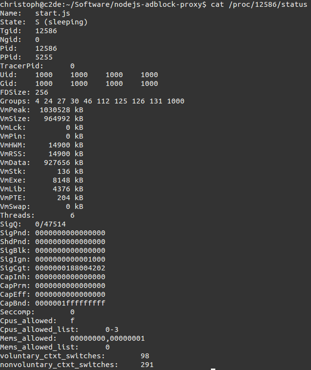
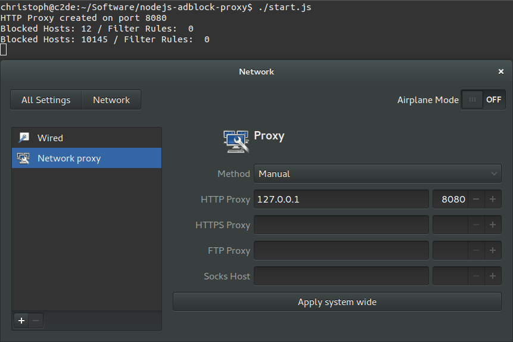

NodeJS AdBlock Proxy
====================

NodeJS Proxy for blocking adverts on the interwebz (with support for Adblock Plus filter lists and /etc/hosts files).
This project aims to make the interwebz even moar awesome!


# Why using a NodeJS based AdBlock Proxy?

- It's blazing fast. Seriously, forget other Proxy implementations.
- It's written in JavaScript !!!!111eleven.

- With a few hours on Facebook, reddit, stackoverflow, it uses this amount of memory (whilst having over 20k blocked hosts and urls with n rulesets):




- And yes, 15MB is way less than a couple GB memory usage of an AdBlock Plus Web Browser extension.
- If you still don't believe it, get over it and use something else. I don't care.


# License

This project is released under the WTFPL.
See the LICENSE.md for details.


# Installation

*Note*: You can change the suggested installation folder to whereever you want to install it.
Just make sure you change the paths in the bash commands accordingly.

- Download and install the newest available stable release of NodeJS from [nodejs.org](http://nodejs.org).

- Download this project via [zip-file](https://github.com/LazerUnicorns/nodejs-adblock-proxy/archive/master.zip) and extract its contents to **/opt/adproxy**.

- Navigate to the folder in your Shell (or PowerShell) and execute:

```bash
cd /opt/adproxy; # change if you used a different folder
nodejs start.js 8080; # will start a proxy on (defaulted) port 8080
```

# Features

- HTTP Proxy
- Host config files support (aka **/etc/hosts**)
- Adblock Plus filter list support ("without element hiding")
- Incremental cache updates for changed files in **./adblockplus.d**, **./host.d** or **./json.d**


# Work-in-progress (aka still not working)

- SOCKS5 Proxy
- Asynchronous cache file database for faster restart
- Support for JSON config files
- Support for AdBlock Plus filter rulesets, based on their fucked up RegExp system


# Usage

## Ubuntu (Gnome Shell)

- Start the Proxy (as shown in [Installation](#Installation))
- Go to **System Settings** > **Network**
- Click on **Network Proxy** on the left side
- Select Method *Manual* and use 127.0.0.1 as IP and 8080 as port

If you started the Proxy setting a different port, please change that accordingly.




## TODO: Other Operating Systems

Documentation about setup on other Operating Systems.
**Contributions welcomed**.

